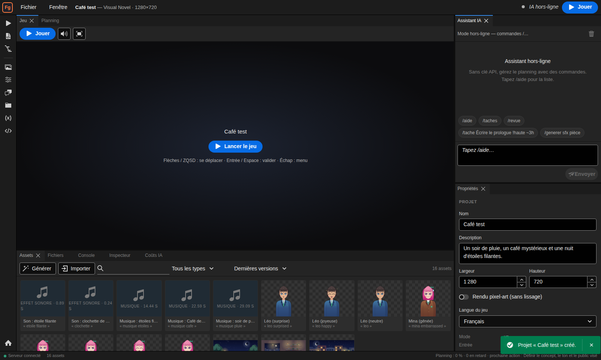
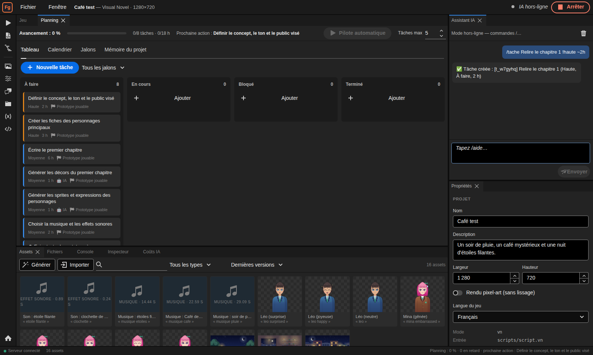
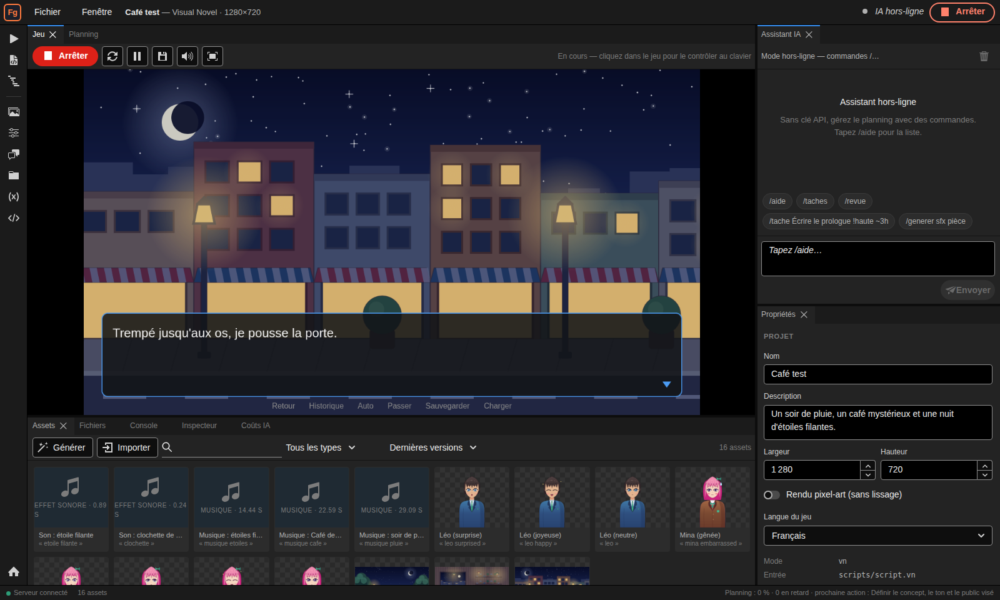
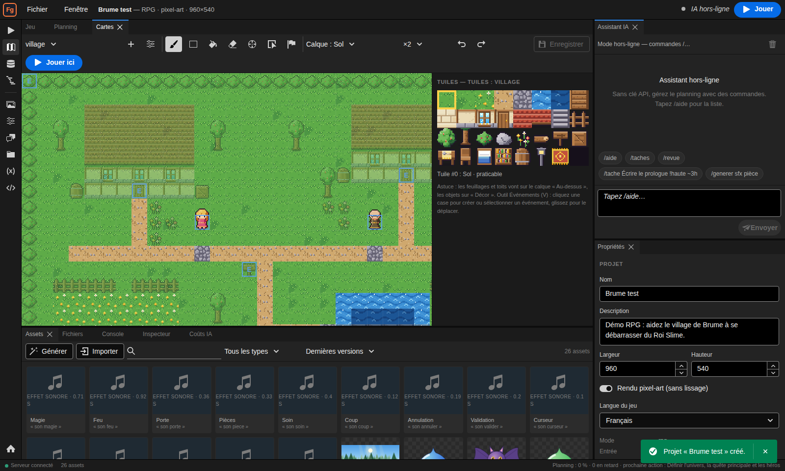
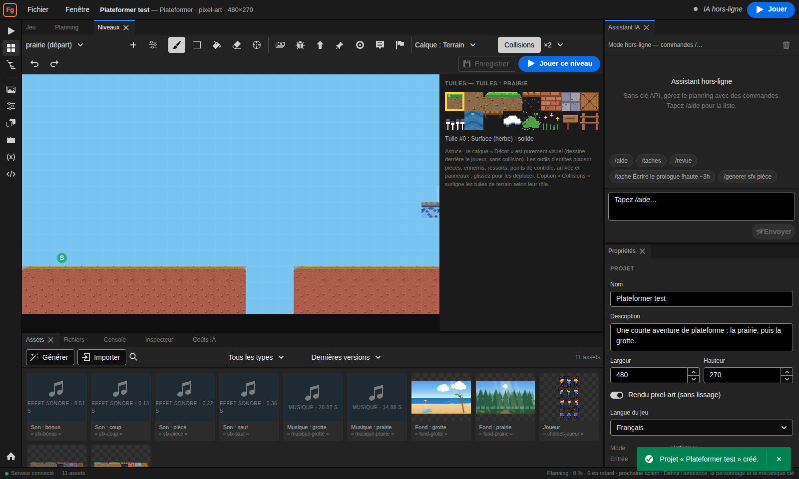
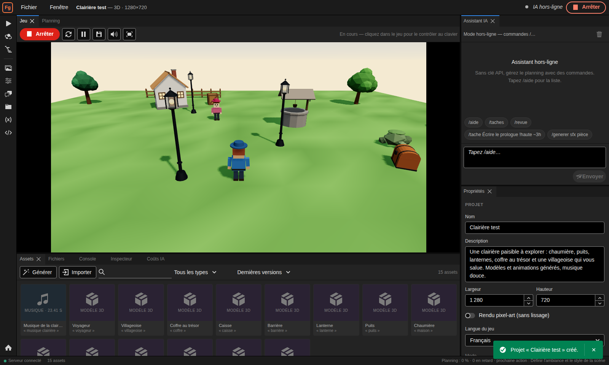

# Forge — moteur de jeu web assisté par IA

Forge est un moteur et un éditeur de jeux vidéo qui tournent dans le navigateur. Il réunit quatre piliers :

1. **Génération d'images** : illustrations et décors vectoriels, portraits de personnages avec expressions, monstres, objets, pixel-art.
2. **Génération d'assets de jeu** : personnages RPG animés (charsets), tilesets, animations 2D, effets sonores, musiques, modèles 3D animés (glTF).
3. **Modes de jeu préinstallés** : *Visual Novel* (langage de script inspiré de Ren'Py), *RPG* (inspiré de RPG Maker : cartes, événements, combats), *Plateformer 2D*, *Bac à sable 3D*.
4. **Planification long terme avec un assistant** : jalons, tâches, dépendances, calendrier, revue d'avancement et mémoire du projet, pilotés depuis un chat ; un **pilote automatique** enchaîne les tâches confiées à l'IA.

Il n'utilise aucun service de génération externe : **c'est Claude qui génère tout**, sous forme de données (SVG, grilles de pixels, partitions, paramètres de synthé, description 3D) que le moteur rend localement. Sans clé API, chaque générateur a un **mode procédural** hors-ligne, et l'assistant comprend des commandes (`/tache`, `/revue`…).



L'interface reprend les codes des suites créatives : thème sombre, panneaux dockables, rail d'outils vertical. Elle est construite avec [React Spectrum](https://react-spectrum.adobe.com/) (design system open source, licence Apache-2.0). Aucun service Adobe n'est utilisé.

---

## Démarrage rapide

Prérequis : **Node.js 22+** et **pnpm 10+**.

```bash
pnpm install
cp .env.example .env        # facultatif : renseignez ANTHROPIC_API_KEY pour activer l'IA
pnpm dev                    # serveur (http://127.0.0.1:8787) + éditeur (http://127.0.0.1:5173)
```

Ouvrez <http://127.0.0.1:5173>, choisissez un modèle (« Démo : Le Café des Étoiles », « Démo : Le Village de Brume », « Démo : La Clairière »…) et cliquez sur **Jouer**.

Pour une installation « production » (éditeur servi par le serveur, export web activé) :

```bash
pnpm build                  # typecheck + build de l'éditeur et du lecteur autonome
pnpm start                  # http://127.0.0.1:8787
```

### Configuration (`.env`)

| Variable | Rôle | Défaut |
|---|---|---|
| `ANTHROPIC_API_KEY` | Active l'assistant et la génération par Claude | — (mode procédural) |
| `FORGE_MODEL` | Modèle Claude utilisé | `claude-opus-5` |
| `FORGE_EFFORT` | Effort du modèle : `low`, `medium`, `high`, `xhigh`, `max` | celui du modèle |
| `FORGE_REFUSAL_FALLBACK` | Repli serveur vers un autre modèle si une demande est refusée | `on` |
| `FORGE_AI` | `auto` (si clé présente), `on`, `off` | `auto` |
| `FORGE_DATA_DIR` | Dossier des projets | `./workspace` |
| `PORT` | Port du serveur | `8787` |
| `FORGE_JOB_CONCURRENCY` | Générations simultanées | `2` |
| `FORGE_VISION_REVIEW` | Critique visuelle des images générées par l'IA (`off` pour la désactiver) | activée |
| `FORGE_ROUTING` | `off` : un seul modèle/effort pour tout (sinon routage par rôle, voir plus bas) | routage actif |
| `FORGE_MODEL_<RÔLE>` / `FORGE_EFFORT_<RÔLE>` | Modèle / effort d'un rôle (`CHAT`, `AUTOPILOT`, `PLAN`, `GENERATE`, `REVIEW`, `SUMMARY`) ; `default` = réglage global | voir plus bas |
| `FORGE_BUDGET_USD` | Budget IA par défaut de chaque projet (dollars) | aucun |
| `FORGE_PRICES` | Prix par modèle en JSON (`{"claude-opus-5":{"input":5,"output":25}}`, $/million de jetons) | estimations intégrées |

---

## L'éditeur

| Zone | Contenu |
|---|---|
| Barre du haut | Menus Fichier / Fenêtre, nom du projet, état de l'IA, bouton **Jouer** |
| Rail d'outils (gauche) | Jeu, éditeurs du mode (script, cartes, base de données, scène 3D), planning, panneaux |
| Centre | Onglets : **Jeu** (lecture dans l'éditeur), **Planning**, documents ouverts |
| Droite | **Assistant IA** (chat) et **Propriétés** (asset ou projet sélectionné) |
| Bas | **Assets**, **Fichiers**, **Console** (journaux + diagnostics), **Inspecteur** (variables du jeu en direct, modifiables) |

Tous les panneaux se déplacent, s'empilent en onglets ou flottent (glisser-déposer). *Fenêtre → Réinitialiser la disposition* restaure l'agencement par défaut.

### Assets

- **Générer** : choisissez un type (image vectorielle, pixel-art, personnage RPG, tileset, animation 2D, effet sonore, musique, modèle 3D), décrivez-le et ajustez ses paramètres. Moteur *IA*, *procédural* ou *automatique*.
- **Alias** : chaque asset peut porter un alias (`bg cafe`, `mina joyeuse`, `tiles village`) utilisé par les scripts et les cartes. Une nouvelle version reprend l'alias : les scripts utilisent toujours la plus récente.
- **Variantes et retouches** : « Nouvelle variante » régénère avec une autre graine ; « Retoucher avec l'IA » modifie l'asset selon une instruction (« rends le ciel plus orageux »). L'historique des versions est conservé.
- **Import** : PNG, JPG, WebP, SVG, WAV, MP3, OGG, GLB.
- **Critique visuelle** : pour les images, personnages, tilesets et animations produits par l'IA, le rendu PNG est renvoyé à Claude qui le compare à la demande et corrige la description si besoin (interrupteur dans la fenêtre de génération).

### Assistant IA et planification

L'assistant (Claude) voit à chaque message l'état du projet, le planning et la **mémoire du projet**. Il peut :

- planifier (`plan_project`, `create_task`, `update_task`, jalons, dépendances, échéances, tâches récurrentes) et faire des revues d'avancement ;
- mémoriser les décisions durables (univers, personnages, style) ;
- lire et écrire les fichiers du projet (scripts, cartes, données) en vérifiant les erreurs ;
- générer des assets et réaliser lui-même les tâches qui lui sont confiées.

**Pilote automatique** (bouton dans le planning) : l'assistant prend les tâches qui lui sont confiées, dans l'ordre du planning et des dépendances, les réalise avec ses outils puis les marque terminées ou bloquées (avec la raison), dans la limite du nombre de tâches choisi. Il partage un verrou avec le chat : l'un attend l'autre.



Le planning s'affiche en **tableau Kanban** (glisser-déposer), **calendrier** (Gantt calculé d'après les estimations, les dépendances et vos heures disponibles), **jalons** et **mémoire**. Les conversations sont conservées (et archivées quand on repart de zéro) ; les longues conversations sont compactées automatiquement.

Sans clé API, le chat accepte : `/tache Titre !haute @2026-10-01 ~3h #art`, `/taches`, `/fait <id ou titre>`, `/encours <…>`, `/jalon Titre @date`, `/revue`, `/note Texte`, `/generer <générateur> <description>`, `/aide`.

### Coûts de l'IA

Chaque appel est journalisé par projet (`usage.jsonl`) : rôle, modèle, effort, jetons (dont lecture/écriture du cache) et coût estimé. Le panneau **Coûts IA** affiche le total, le budget, le taux de cache et la répartition par rôle, modèle et jour. Avec un budget, les nouveaux appels sont refusés une fois la limite atteinte ; la génération bascule alors en procédural.

Pour dépenser moins sans perdre en qualité, chaque rôle a son modèle : le chat et le pilote automatique utilisent le modèle principal, les descriptions d'assets (vérifiables par leur schéma) passent par Claude Sonnet 5 et les résumés par Claude Haiku 4.5. Quand une description reste invalide après les corrections, une **escalade** relance avec plus d'effort, puis avec le modèle principal. Les schémas compatibles utilisent l'**usage strict des outils** pour éviter les essais ratés.

### Export

*Fichier → Exporter pour le web* produit un `.zip` autonome (lecteur + fichiers du projet) à déposer sur n'importe quel hébergement statique (vérifié : le zip décompressé et servi par un simple serveur statique se joue dans Chromium). Nécessite `pnpm build`.

---

## Les modes de jeu

### Visual Novel (inspiré de Ren'Py)

Le jeu est écrit dans un script `.vn` indenté, très proche de Ren'Py :

```
define m = Character("Mina", color="#f6a5c0")
default affection = 0

label start:
    scene bg cafe with fade
    play music "musique cafe" fadein 1.0
    show mina happy at left with dissolve
    m "Bienvenue au Café des Étoiles, [nom] !"
    menu:
        "Que commandez-vous ?"
        "Un chocolat chaud":
            $ affection += 1
            m "Excellent choix."
        "Rien, merci" if affection < 0:
            jump depart
    if affection >= 1:
        call confidences
    return
```

Instructions : `define`, `default`, `image`, `include`, `label`, `scene`, `show … at … with …`, `hide`, `with`, dialogues (`perso "texte"`, `"texte"`, `"Nom" "texte"`), `menu` (choix conditionnels), `if / elif / else`, `$ instruction`, `jump`, `call`, `return`, `pause`, `play / stop music|sound|voice`, `window show|hide`, `centered`, `pass`. Positions : `left`, `right`, `center`, `farleft`, `farright`. Transitions : `fade`, `dissolve`, `moveinleft`, `moveinright`, `vpunch`, `hpunch`. Interpolation `[expression]` dans les textes.

Les images sont désignées par l'alias de leurs assets (`show mina happy` utilise l'alias « mina happy », sinon « mina »). Le lecteur gère l'écran titre, l'avance automatique, le passage rapide, l'historique, le **retour arrière** (molette), et 6 emplacements de sauvegarde. L'éditeur de script signale les erreurs en direct et permet de **jouer depuis n'importe quel label**.

Les expressions (`$`, `if`, interpolation) utilisent un langage sûr de type Python, sans `eval` : `score >= 10 and not vu`, `inventaire.append("clé")`, `"oui" if x else "non"`, `randint(1, 6)`…



### RPG (inspiré de RPG Maker)

- **Cartes** en tuiles 16×16 sur trois calques (sol, décor, au-dessus du personnage), collisions automatiques d'après le rôle des tuiles et surchargeables case par case, rencontres aléatoires.
- **Tilesets standardisés** : tous les tilesets (village, forêt, donjon, intérieur, désert, neige, grotte) placent les mêmes rôles aux mêmes index (sol, chemin, eau, murs, toits, arbres, meubles…). Une carte reste valide quand on régénère ou change de tileset.
- **Événements** à pages (conditions : interrupteurs, variables, objets, interrupteurs locaux ; déclencheurs : action, contact, automatique, parallèle) et **commandes** : textes, choix, conditions, interrupteurs, variables, objets, or, téléportation, combats, attentes, sons, musiques, trajets, soins, effacement, script…
- **Combats** au tour par tour (attaque, compétences, objets, défense, fuite), expérience, niveaux, butin.
- **Base de données** : héros, objets, compétences, ennemis, troupes, réglages système (équipe, départ, musiques, sons).
- **Éditeur de cartes** : crayon, rectangle, remplissage, gomme, pipette, calque de collisions, placement et édition des événements, point de départ, annuler/rétablir, « Jouer ici ».



### Plateformer 2D

- **Niveaux** en tuiles vues de côté (`levels/<id>.json`) avec un tileset standard de 16 rôles (surface, terre, bords, plateformes traversables par-dessous, briques, pics, eau, ponts, nuages, décor) : un niveau reste valide quand on change de thème (prairie, grotte, château, neige, désert).
- **Jouabilité** : accélération, saut à hauteur variable, tolérance au bord (*coyote time*) et mémorisation du saut, pièces, ennemis à écraser (marcheurs, sauteurs), ressorts, points de contrôle, arrivée, panneaux, temps limite, vies et score.
- **Éditeur de niveaux** : pinceau, rectangle, gomme, pipette sur les calques terrain et décor, placement et réglage des entités, point de départ, surlignage des collisions, « Jouer ce niveau ».
- La démo enchaîne une prairie et une grotte ; l'assistant connaît le format des niveaux (guide intégré au mode).



### Bac à sable 3D

Une scène (`scenes/main.json`) décrit le ciel, le sol, le joueur et des objets (modèles glTF générés, position, rotation, échelle, animation en boucle, collision, texte et animation d'interaction). Le joueur se déplace en vue à la troisième personne (ZQSD / flèches, Maj pour courir, souris pour orbiter, Entrée pour interagir). L'éditeur de scène permet de placer et régler les objets.



---

## Architecture

```
packages/
  core/            runtime : boucle de jeu, entrées (clavier, souris, manette), audio, sauvegardes,
                   langage d'expressions sûr, format projet, registre des modes, tuiles standard
  render2d/        rendu PixiJS : scène, textures, fenêtre de dialogue, menus, fondus, animations
  render3d/        rendu Three.js : vue, glTF, animations, caméra 3e personne, visionneuse de modèles
  mode-vn/         Visual Novel (parseur, compilateur, interpréteur avec retour arrière, rendu)
  mode-rpg/        RPG (monde, événements, combats, base de données, constructeur de cartes, rendu)
  mode-platformer/ Plateformer 2D (physique, entités, session, niveaux, rendu)
  mode-sandbox3d/  Bac à sable 3D (scène, déplacements, collisions, interactions)
  generators/      générateurs d'assets : spec IA validée → rendu (PNG, WAV, GLB…) + repli procédural
  ai/              client Claude, génération structurée validée (zod) avec correction automatique,
                   boucle d'agent à outils en streaming
  planner/         planification : tâches, jalons, dépendances, calendrier, mémoire, outils de l'agent
apps/
  server/          Fastify : projets sur disque, file de générations, SSE, chat, export
  editor/          éditeur React + React Spectrum + dockview, lecteur autonome pour l'export
```

Principes :

- **L'IA produit des données, jamais du code exécuté.** Chaque générateur définit un schéma (zod) ; la réponse de Claude est validée, et en cas d'erreur les problèmes lui sont renvoyés pour correction. Les SVG sont assainis avant rendu.
- **Logique pure et testée, rendu séparé.** Les interpréteurs VN et RPG, les combats, le planning, les générateurs… sont testés sans navigateur ; PixiJS et Three.js ne sont chargés qu'à l'exécution du jeu.
- **Projets = fichiers lisibles** : `project.json` (manifeste + assets), scripts `.vn`, cartes et données JSON, `planner.json`, journal du chat. Versionnables avec git.

## Tests

```bash
pnpm typecheck     # TypeScript strict sur tous les packages
pnpm test          # tests unitaires et d'intégration (Vitest)
pnpm e2e           # parcours complet dans Chromium (Playwright) avec captures d'écran
pnpm check         # par package : TypeScript + tests + format Prettier, résumé court
node scripts/snap.mjs --template rpg-demo   # joue un modèle dans Chromium : captures + erreurs console
```

La CI GitHub Actions (`.github/workflows/ci.yml`) vérifie le format, compile, teste et lance l'e2e à chaque push.

## Développer avec des agents IA

Le dépôt est préparé pour être développé par Claude Code et des sous-agents :

- `CLAUDE.md` : carte des packages, conventions et commandes, lue automatiquement par chaque agent.
- `.claude/agents/` : rôles spécialisés (architecte, implémenteur, auteur de tests, vérificateur…) avec le modèle adapté à chacun.
- `.claude/workflows/forge-find.js` et `forge-fix.js` : revue en lecture seule par zones, puis correction par groupes de fichiers disjoints avec un vérificateur par groupe.
- Un hook formate avec Prettier chaque fichier écrit par un agent ; `scripts/check.mjs` et `scripts/snap.mjs` remplacent des contrôles qui demanderaient sinon un agent.

## Feuille de route

- Autotiles et outils de carte avancés (calques de régions, copier-coller de zones).
- Nouveau mode : point & click.
- IA : cache et réutilisation des descriptions d'assets, génération par lots (API Batches), critique visuelle déclenchée seulement sur un rendu suspect, direction artistique du projet injectée dans toutes les générations.
- Éditeur visuel des commandes d'événements RPG plus complet, éditeur de scène 3D avec manipulation directe.
- Doublage (voix) et localisation des textes de jeu.
- Collaboration temps réel et historique Git intégré.
